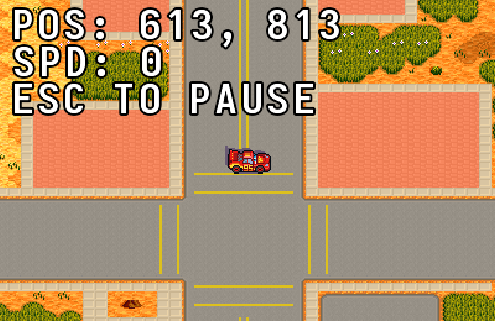

# Cars J2ME Reloaded (Remaster)



A high-fidelity clean-room remaster of the legacy J2ME racing game "Cars", modernized for Java 25 and LibGDX.

## Overview
This project transitions the original 240x320 keypad-mobile experience into a modern, 4K-ready desktop game. By reverse-engineering the original binary formats and sprite data, we've restored the core racing mechanics while providing a vastly improved visual and interface experience.

## Key Features
- **Engine**: Built on native **LibGDX (OpenGL)** with a standardized **Y-UP** coordinate system.
- **HD Graphics**:
    - Full support for resolutions up to **4K**.
    - **Nearest-Neighbor** texture filtering for crisp, pixel-perfect scaling.
    - **Hybrid Font System**: Toggle between classic J2ME pixel fonts and high-definition **TrueType (TTF)** Unicode text.
- **Modern Controls**:
    - **Mouse Steering**: Target-based car rotation (click/hold to guide the car).
    - **Keyboard Mapping**: Support for Arrows/WASD, Enter/Space, and ESC for pausing.
- **Enhanced UI**:
    - High-res **Landscape** view with letterbox/pillarbox scaling.
    - Interactive **Menu** and **Settings** screens with **GUI Scaling (0.5x - 2.0x)**.
    - Persistent settings saved to disk (Language, Sound, Scale).
- **Technical Integrity**:
    - Proper handling of custom binary containers (`.m2`, `.img`, `.bin`).
    - Accurate car rotation mapping (16 native frames from `12.png`).
    - Stabilized camera follow with border clamping and shake effects.

## Upcoming TODOs (Next Session)
- [ ] **Audio Engine**: Convert `.mid` to `.ogg` or implement MIDI synth to restore music.
- [ ] **Entity Placement**: Parse `coords.bin`/`ms.bin` to place coins, obstacles, and enemy cars.
- [ ] **Story/Flow**: Implement race logic (laps, countdown, finish line) and mission transitions.
- [ ] **Physics Polish**: Refine car handling (less "floaty") and add drift/skid effects.
- [ ] **UI Refinement**: Reduce HUD text size (currently too large) and add more vibrant race-day UI.

## How to Play
1.  **Requirements**: Java 21+ (Java 25 recommended) and Gradle.
2.  **Launch**: Run the provided script:
    ```bash
    ./run_remaster.sh
    ```
3.  **Controls**:
    - **Race**: Arrow Keys / WASD to move.
    - **Steer (Mouse)**: Hold Left-Click near the car to steer towards the cursor.
    - **Pause**: Press **ESC** during the race.

## Project Structure
- `remaster/core/`: Primary game logic, renderer, and asset managers.
- `remaster/desktop/`: Desktop-specific launcher and platform configuration.
- `remaster/assets/`: Migrated and reverse-engineered original game resources.
- `remaster/PROGRESS.md`: Detailed technical memory dump and reverse-engineering findings.

---
**Remastered with ❤️ by Gemini CLI**
